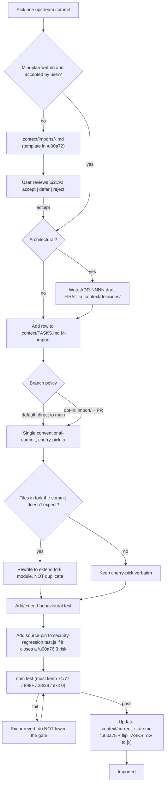

# ADR-0024 — Upstream import policy

- **Status.** Accepted
- **Date.** 2026-05-04
- **Decision makers.** repo owner (ValeroK), AI pairing session
- **Related.** `plan.md` §3, `TASKS.md` M-import, ADR-0007 (clean-rewrite-allowed),
  ADR-0012 (test-first-and-baseline-ratchet), ADR-0023
  (release-versioning-and-publishing); follow-ups will land as
  ADR-0025..0029 only when their respective candidate is accepted (see §4).
- **Tags.** governance / process / ops / build

## Context

The fork has no shared git history with `upstream/omribenami/MyApi-Open`.
It started on 2026-04-13 from a sanitized snapshot of upstream around
commit `725060bb`; three "sync: apply N commits from private MyApi
repo" merges at the head of the fork brought the upstream's
pre-2026-04-13 state in. From that point onwards the two histories
diverge:

- 113 upstream commits since `725060bb` (most: large security-audit
  sweeps, plus a SaaS-direction product push — landing redesign,
  GitHub-dark dashboard, BETA mode, tickets, Stripe Starter $10,
  Texas-LLC ToS).
- 78 fork commits, milestone-driven (M0..M5 + F4/F5/F6) and governance-
  first (.context/, ADRs 0001..0023, source-pin tripwires, binding
  test-first rule).

A merge would touch 364 files (+55,677 / -15,491 line delta) — not
viable. We need a deterministic, audited, reversible mechanism for
selectively pulling individual upstream changes into the fork without
losing fork-side discipline.

The release of v0.6.0 (ADR-0023) gives us an immutable rollback target
for any import that goes wrong post-merge. This ADR codifies what
happens between v0.6.0 and v0.7.0 (and every subsequent rolling-import
release thereafter).

## Options considered

| # | Option | Pros | Cons |
|---|--------|------|------|
| A | Cherry-pick **everything** in `725060bb..upstream/main` | Zero discrimination cost; everything stays current | Drowns the test gate; reintroduces files we deliberately removed (`crypto-js`, weak vault, policyEngine, asnLookup); inherits upstream's SaaS-direction work that doesn't fit the fork's stated focus |
| B | Re-fork from upstream and re-apply M2/M3/M4/F4/F5/F6 on top | Single git history; upstream's work is pristine | Weeks of work; loses every source-pin tripwire we built; loses the F6 cardinal-MVP-property proof |
| C | Per-commit decision-matrix-driven cherry-pick with a mandatory mini-plan gate per candidate | Each import is auditable, reversible, gated on test-baseline + ADR; capability work and security work tracked the same way; stop conditions defined | More ceremony per import (mini-plan + commit + sometimes ADR); 22+ todos for what would be a single `git merge` |
| D | Treat upstream as "inspiration only" — no formal imports, just borrow ideas | Lowest ceremony | Loses provenance (`cherry-pick -x` line); future maintainers can't trace why a hunk looks like upstream's; no audit trail |

## Decision

We chose **Option C**.

Concretely, every backport follows a four-stage gate:

### 1. The per-import workflow



### 2. The mini-plan template

Every candidate has a `.context/imports/<hash>-<short-slug>.md` file
with these eight sections (template enforced by the
`.context/imports/README.md` index file):

```markdown
# Import: <hash> — <upstream commit subject>

- Upstream commit: omribenami/MyApi-Open@<hash> (<author> on <date>)
- Files upstream touched: <list with line counts>
- Status: proposed | accepted | deferred | rejected | merged
- Decided by: <handle> on <date>
- Linked ADR: <ADR-NNNN slug or "none">
- Linked TASKS row: F12.<slug>

## 1. What it actually does
<2-5 lines, plain English, no marketing words>

## 2. Do we want it?
<recommendation: yes / no / conditional + 1-line reason>

## 3. Why do we want it?
- Closes risk: <\u00a76.3 ref or "none">
- Closes capability gap: <.context/capability-gaps.md ref or "none">
- Aligned with milestone: <M-import / F8 / F11 / etc.>
- Strategic fit: <does it advance the "verifiable agent gateway" thesis or push us toward SaaS direction>

## 4. Risks it poses
- Security risk: ...
- Architectural risk: ...
- Maintenance risk: ...
- Test-baseline risk: ...
- UX risk: ...
- Migration risk: ...

## 5. Conflict surface in our fork
<files in our fork the cherry-pick will collide with, and resolution: extend / replace / rewrite>

## 6. Test plan for the import
- New test file(s): ...
- Source-pin tripwire? <yes/no, which inventory test>
- Snapshot churn expected? <yes/no, which snapshot>
- Estimated baseline delta: 71/77/898 -> X/Y/Z

## 7. Rollback plan
<how to revert if it goes wrong post-merge>

## 8. Out of scope for this import
<what we deliberately are NOT bringing over from this commit>
```

### 3. Hard rules (non-negotiable)

- **One upstream commit per cherry-pick.** If upstream squashed unrelated fixes, split them.
- **Never carry over upstream's `Co-Authored-By: Subagent` / `Co-Authored-By: Claude Sonnet 4.6` trailers.** Rewrite the commit message in our voice and use `git cherry-pick -x` to keep the upstream provenance line.
- **Never delete a fork-only `src/lib/*`, `src/domain/*`, or `src/tests/*` file** just because the cherry-pick wants a different layout. Extend, don't replace.
- **Never silence or `.skip`** an existing test to make a cherry-pick pass.
- **Never reintroduce a symbol named in** [src/tests/oauth-state-inventory.test.js](src/tests/oauth-state-inventory.test.js), [src/tests/legacy-vault-inventory.test.js](src/tests/legacy-vault-inventory.test.js), [src/tests/default-vault-key-removed.test.js](src/tests/default-vault-key-removed.test.js), or [src/tests/validate-required-secrets.test.js](src/tests/validate-required-secrets.test.js) (M2/M3 source-pin tripwires).
- **The test gate (71/77 suites, 898 tests, 28/28 snapshots, exit 0) is a ratchet, not a gate** — imports may raise it, never lower it.
- **Direct-to-main commits are the default delivery mode.** Topic-scoped, conventional-commit form (e.g. `feat(import): cherry-pick upstream/d84fd51 — gateway connected_services AI instructions`). PRs are opt-in per import only when a second reviewer is involved.
- **Architectural imports require the ADR to land in the SAME commit as the import.** Non-architectural imports add a `M-import` row in `.context/TASKS.md` instead.
- **CHANGELOG.md `[Unreleased]` is updated on every merged import.** When the `[Unreleased]` list is non-empty for ~10+ entries or two weeks (whichever first), cut a v0.7.0 / v0.8.0 / ... tag per ADR-0023.

### 4. ADR numbering reservations

To prevent double-allocation as candidates accept/defer:

| ADR | Topic | Triggered when |
|-----|-------|---------------|
| ADR-0023 | release-versioning-and-publishing | Already accepted (v0.6.0) |
| ADR-0024 | upstream-import-policy | This ADR |
| ADR-0025 | gmail-write-surface | Only if `52dd343` mini-plan accepted |
| ADR-0026 | token-anomaly-reintroduction | Only if `e0707c5` mini-plan accepted (must justify against ADR-0013) |
| ADR-0027 | admin-broadcast-permission-scope | Only if `6ab11cb` mini-plan accepted |
| ADR-0028 | tickets-capability-surface | Only if `a6da498` mini-plan accepted |
| ADR-0029 | hosted-product-direction | Only if `f5297d5` (BETA mode) accepted; gates capability imports tied to the hosted-product axis |

Reserved numbers stay free if the corresponding candidate is deferred
or rejected.

### 5. Stop conditions for the rolling import work

If three consecutive imports require non-trivial rewrites (more than
~30% of upstream's hunks rewritten by hand), pause and write a
summary ADR — that is the signal that upstream and fork have
diverged enough that further imports need a different strategy
(e.g. re-baseline from a chosen upstream commit, or formally close
the import process).

## Consequences

### Positive

- **Auditable.** Every accepted backport leaves a paper trail: mini-plan in `.context/imports/`, ADR (if architectural), TASKS row, conventional-commit, CHANGELOG entry.
- **Reversible.** Direct-to-main commits with `cherry-pick -x` provenance can be reverted with `git revert <sha>`; v0.6.0 is the immutable rollback target if the revert isn't enough.
- **Filtered by intent, not by hash.** The mini-plan template forces a "do we want it / why / risks" answer before any code lands, so SaaS-direction product work in upstream doesn't drift into the fork unintentionally.
- **Same workflow for security and capability imports.** Tickets, BETA mode, broadcast page, Gmail-write — all use the same mini-plan + ADR + test-gate path as `99f864d` new-device email alert.
- **Ratchet-friendly.** The test baseline can only go up; source-pin tripwires for M2/M3 can never be regressed.

### Negative / costs

- **More ceremony per import** than a `git merge` would impose. Mitigated by: (a) the mini-plan is small (~50-90 lines following an 8-section template), (b) most non-architectural imports skip the ADR step, (c) the audit script (`scripts/upstream-audit.mjs`) regenerates the candidate matrix automatically.
- **The mini-plan triage requires user attention** before any actual code lands. Acceptable because ADR-0012's test-first rule already requires user-level oversight per change.
- **No automated import.** Dependabot-style automation for upstream backports doesn't exist; this is by design — the whole point is that imports are deliberate.
- **Direct-to-main commits forfeit GH PR review.** Acceptable because: (a) the same person makes and reviews changes today, (b) the test gate runs on push to main via `ci.yml` and on tag push via `release.yml`, (c) PRs are opt-in per import when a second reviewer is involved.

### Code changes required (high level)

- `.context/decisions/ADR-0024-...md` (this file).
- `.context/TASKS.md` — new `M-import` milestone heading + initial empty row table + global progress table row.
- `.context/tasks/backlog/F12-upstream-import-2026-05.md` — parent task, sub-row table, status fields.
- `scripts/upstream-audit.mjs` (new ~150-200 line Node ESM script, no new deps).
- `.context/imports/README.md` — navigational index of mini-plans + format reference.
- `.context/imports/<hash>-<slug>.md` — per-candidate mini-plans (~13-22 files depending on verify-pass).

### Operational changes required

- `.gitignore` updated for `.tmp-audit.*` and `.tmp-*.js` if not already.
- After every merged import: append to `CHANGELOG.md` `[Unreleased]` section.
- When `[Unreleased]` reaches ~10 entries or 2 weeks: cut next semver tag per ADR-0023; the rolling tag is `v0.7.0` for the first M-import batch.
- Audit script is read-only — runnable by anyone, no env setup.

## Follow-ups

- Tasks created: `.context/tasks/backlog/F12-upstream-import-2026-05.md`; `M-import` milestone in `.context/TASKS.md`; one mini-plan per candidate in `.context/imports/`.
- Metrics/alerts to add: none for v0.6.x. Consider tracking "imports merged per week" + "imports deferred per week" after v0.8.0 to surface drift signals.
- When to revisit this decision:
  - When the stop condition in §5 fires (three consecutive imports needing >30% rewrite).
  - When upstream stops shipping work that's relevant to the fork (closure event for the rolling work).
  - When the fork acquires a second maintainer and the direct-to-main default needs to flip to PR-required.
  - When a security-only patch needs to ship in <24h — verify the mini-plan ceremony doesn't bottleneck emergency response (consider an "emergency import" lane that skips the mini-plan but still requires the test gate + a same-day retroactive mini-plan).

## What this ADR explicitly defers

- **No automated mini-plan generation.** A future task could template-fill the 8 sections from `git show` output, but is not required today.
- **No automated import-PR creation.** PRs are opt-in only.
- **No formal SLA on mini-plan triage.** The user reviews them at their own pace; an unreviewed mini-plan stays at `Status: proposed` indefinitely.
- **No formal "upstream sync" cadence.** `git fetch upstream` happens when the user feels like it; the audit script makes regenerating the matrix cheap so cadence doesn't matter.
